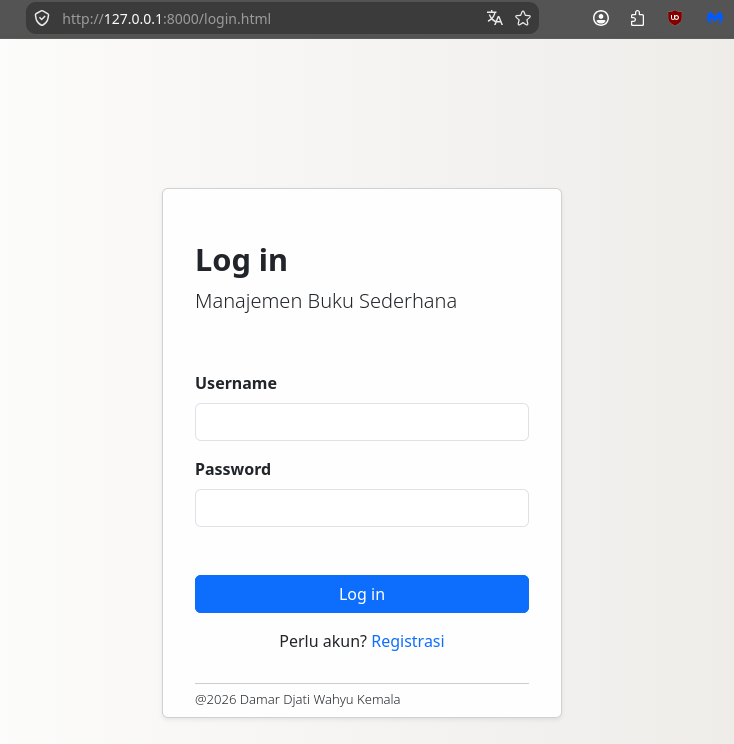
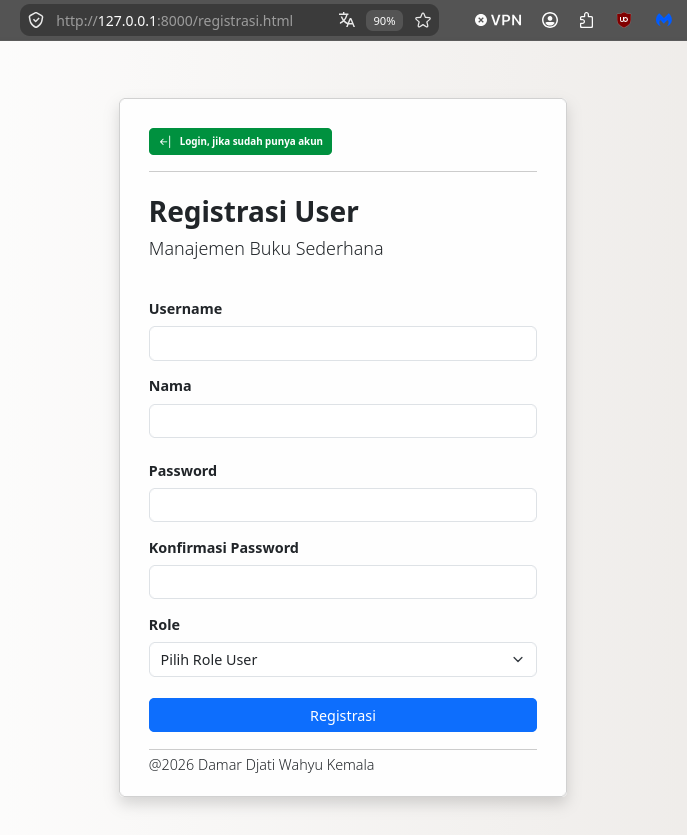
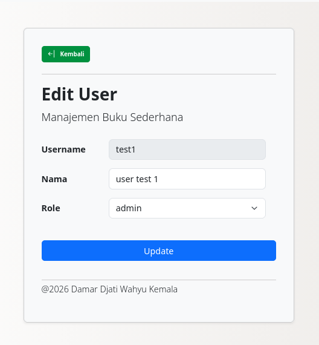
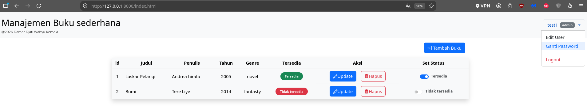

## Manajemen Buku API dengan OAuth2 (Tanpa JWT)

Endpoint Manajemen buku sederhana menggunakan FastAPI, Tanpa JWT dan Database

## Topik Lanjutan (On-Progress)

 - ✅ FastAPI
 - ✅ APIRouter
 - ✅ Layered Structure
 - ✅ OAuth2 (Non-JWT) (Login User dan Handle CRUD Data Buku)
 - ✅ Registrasi User
 - ✅ Edit Profile User
 - ⬜️ Ganti Password User (On-Progress)

## Tech Stack

#### Backend


#### Frontend


## Sekilas Update Halaman Yang Sudah Dikerjakan

<div align="center">
  <table border="0" style="border-collapse: collapse; border: none;">
    <tr>
      <td align="center" style="padding: 15px; border: none;">
        
        <p align="center">
          <sub>Tampilan halaman login manajemen Buku</sub>
        </p>
      </td>
      <td align="center" style="padding: 15px; border: none;">
        
        <p align="center">
          <sub>Tampilan halaman registrasi user manajemen Buku</sub>
        </p>
      </td>
      <td align="center" style="padding: 15px; border: none;">
        
        <p align="center">
          <sub>Tampilan halaman edit user manajemen Buku</sub>
        </p>
      </td>
    </tr>
  </table>

  <table border="0" style="border-collapse: collapse; border: none;">
    <tr>
      <td align="center" style="padding: 15px; border: none;">
        
        <p align="center">
          <sub>Tampilan revisi halaman manajemen Buku</sub>
        </p>
      </td>
    </tr>
  </table>
</div>

## Endpoints

### User - Auth
---
| Method | Endpoint | Description |
|---|---|---|
| POST | `/login` | Login user |
| POST | `/logout` | Logout user |
| POST | `/registrasi` | Registrasi user |
---

### User
---
| Method | Endpoint | Description |
|---|---|---|
| GET | `/user` | Mendapatkan semua user |
| GET | `/user?id=&username=` | Mendapatkan user berdasarkan ID atau berdasarkan username dan bisa keduanya dengan Query Parameter |
| GET | `/user/aktif` | Load data user ke halaman utama manajemen buku |
| PUT | `/user/update/{username}` | Edit data user dengan data user wajib sama dengan user yang sedang aktif.

---

<br/><br/>

## Tambahan pada kode program pada Auth (Non-JWT)

### `itsdangerous library` (Starlette)
`Proses OAuth non-jwt dan non-database` ini diselipkan dengan library dari starlette (itsdangerous)
untuk menempelkan timestamp berisikan `(TimestampSigner, SignatureExpired, BadTimeSignature)`,
bertujuan untuk mengecek apakah token sudah expired atau belum (dengan set waktu yang saya tetapkan di project manajemen buku ini 3600 detik = 1 jam )

```bash
GET_SECRET_KEY = os.getenv("SECRET_KEY")

if GET_SECRET_KEY is None:
    raise RuntimeError("File .env belum dibuat / tidak ditemukan")

signer = TimestampSigner(GET_SECRET_KEY)
```

### `Argon2`
`Argon2` pada project manajemen buku ini saya gunakan untuk hashed password pada user, dan hasilnya `divalidasi oleh basemodel UserInDB`

```bash
set_hash = PasswordHash.recommended()

def get_password_hash(password: str)-> str:
    return set_hash.hash(password)
```

## Endpoints

### Buku
---
| Method | Endpoint | Description |
|---|---|---|
| GET | `/buku` | Mendapatkan semua buku |
| GET | `/buku?id=&judul=` | Mendapatkan buku berdasarkan ID atau berdasarkan judul dan bisa keduanya dengan Query Parameter |
| GET | `/buku/{id}` | Mendapatkan buku berdasarkan ID |
| POST | `/buku` | Menambahkan buku |
| PUT | `/buku/{id}` | Mengubah buku |
| PATCH | `/buku/{id}` | Update spesifik ke status ketersediaan buku |
| DELETE | `/buku/{id}` | Menghapus buku |
---

### Buku dengan otorisasi token bearer

Untuk `validasi di sisi frontend` dalam mengakses CRUD Buku, pada project manajemen buku oauth2 ini saya tambahkan `bearer token`.
dimana saya pasang dibagian `helper/security.py` lihat disini, [security.py](helpers/security.py)

```bash
token = signer.sign(username).decode("UTF-8")
```

Otorisasi token bearer ini akan diakses disemua halaman CRUD Buku termasuk validasi token apakah sudah expired, atau cek token belum ada atau sudah ada.

Salah satu contohnya : 

endpoint get_buku pada router "/buku" ini mengirim request ke sisi logic repositories/buku.py,
yang didalamnya terdapat validasi untuk cek token (expired / token belum ada).

- Kode dibawah ini endpoint dari "/buku" (Method: GET), bisa cek kodenya disini [buku.py](routers/buku.py)
```bash
router_buku = APIRouter(prefix="/buku", tags=["buku"])

oauth2_scheme = OAuth2PasswordBearer(tokenUrl="/login")

@router_buku.get("", response_model=ResultBuku[BukuBase | list[BukuBase]])
async def get_buku(id: Annotated[int | None, Query()] = None, judul: Annotated[str | None, Query()] = None, token: Annotated[str, Depends(oauth2_scheme)] = None):
    
    return await result_get_buku(id=id, judul=judul, token=token)

```

- Kode dibawah ini salah satu logic dari `repositories/buku.py`, bisa cek kodenya disini [buku.py](repositories/buku.py)
```bash
async def result_get_buku(id: int | None=None, judul: str | None=None, token: str | None=None) -> ResultBuku[BukuBase | list[BukuBase]]:
    
    if token is None:
        raise HTTPException(
            status_code=status.HTTP_401_UNAUTHORIZED,
            detail="Sesi habis, login terlebih dahulu"
        )

    username_aktif = verify_access_token(token, 3600)

    ....
```

Jadi `jika token` expired atau token belum ada sama sekali `proses CRUD Buku akan distop` dan di kembalikan ke `login.html`

- Kode dibawah ini `validasi dari sisi frontend`, bisa cek kodenya disini [cek_token.js](frontend/js/cek_token.js)
```bash
async function cek_auth_token(url, options={}){
  const token = localStorage.getItem('access_token');

  if(!token){
      window.location.replace("/login.html");
      return;
  }

  options.headers ={
      ...options.headers,
      'Authorization': `Bearer ${token}`,
      'Content-Type': 'application/json'
  }

  try{
      const response = await fetch(url, options)

      if (response.status == 401){
          localStorage.removeItem("access_token");

          await Swal.fire({
              icon: "warning",
              title: "Sesi login berakhir",
              text: "Sesi login anda habis, Silahkan login kembali",
              confirmButtonText: 'OK',
              allowOutsideClick: false
          });

          window.location.replace("/login.html")
          return;
      }

      return response;
  } catch(error){
      console.error('Error cek auth token :  ', error);
      throw error;
  }
}
```

Dan `disisi frontend pada get buku`, kodenya pendek, seperti berikut ini:
```bash
async function getBuku(){

    const data_buku = await cek_auth_token("/buku");

    if (!data_buku) return;
```


<br/><br/>


## Cara Clone dan Eksekusi Program

### 1. Clone Repo

```bash
  git clone https://github.com/dams-code/manajemen-buku-api-oauth2.git
  cd manajemen-buku-api-oauth2
```

### 2. Membuat Virtual Environment(env)
Jika memakai Windows :
```bash
  python -m venv .venv
  .venv\Scripts\activate
```

Jika memakai Linux / Mac:
```bash
  python3 -m venv .venv
  source .venv/bin/activate
```

`Tambahan Penting`, karena diproject `manajemen buku berbasis oauth2` ini menggunakan `itsdangerous` library dari starlette,
kita buat file `.env` untuk menyimpan **SECRET_KEY** -nya.

```bash
  buat file text baru dengan nama .env   (bukan python -m venv .env)
  
  isi file dengan isian berikut, dan kemudian simpan

  SECRET_KEY="....."
```

load hasil `.env` tadi dengan kode berikut ini. (kode bisa dilihat pada link ini [security.py](helpers/security.py)) 

```bash
from dotenv import load_dotenv
import os

load_dotenv()

GET_SECRET_KEY = os.getenv("SECRET_KEY")

if GET_SECRET_KEY is None:
    raise RuntimeError("File .env belum dibuat / tidak ditemukan")
```


kenapa dipisah jadi ada 2 .venv dan .env, 
- untuk `.venv` hanya untuk menyimpan list library python dan pendukung lainnya,
- sedangkan `.env` untuk menyimpan data penting.
<br/> <br/>

### 3. Install dependency

```bash
  pip install "fastapi[standard]" # untuk memperoleh pydantic (untuk data validation), APIRouter untuk map url endpoint dan kategori endpoint, dan uvicorn sebagai server. 
  pip install "pwdlib[argon2]" # untuk eknrpisi password user.
  pip install "itsdangerous" # dipakai untuk menangani authentikasi (non-jwt dan non-database)

  pip install python-dotenv # untuk open dan extract file env berisi SECRET_KEY
```

### 4. Eksekusi FastAPI Server

Jika memakai UV:
```bash
  uv run fastapi dev main.py
```
Jika memakai non-UV:
```bash
fastapi dev main.py
```

### 5. Cek endpoint dan uji coba endpoint di Swagger UI
```bash
  http://127.0.0.1:8000/docs#/
```

### 6. Test di tampilan frontend (mount html)

karena lokasi middleware untuk mount index.htmlnya diset ke "/" untuk akses ke local pakai / diakhir port.

```bash
  http://127.0.0.1:8000/
  http://127.0.0.1:8000/login.html
```

</div>

## Copyright Personal Portfolio
* **Project Owner / Created By:** Damar Djati Wahyu Kemala
* **Study:** FastAPI endpoint CRUD buku sederhana versi ke 2 dengan OAuth2
* **Date Created:** Agustus 2026
* **GitHub Portfolio:** [https://github.com/dams-code](https://github.com/dams-code)
